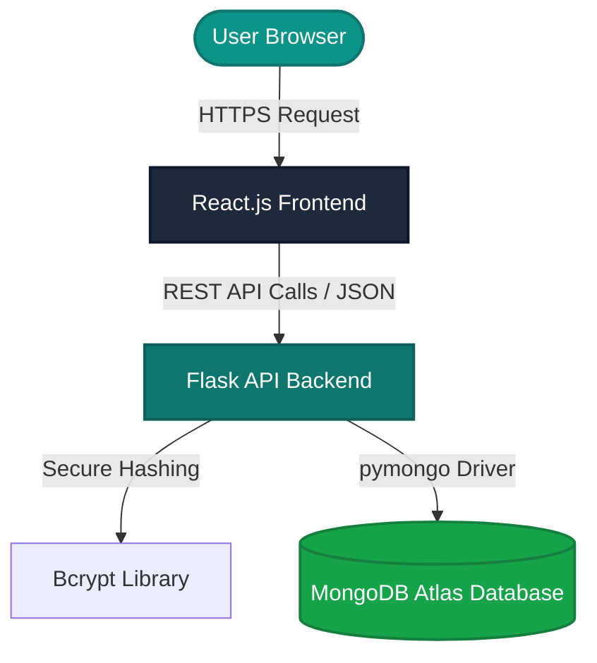

# Assignment 3 (CLO-2): Web Application Design & Testing Task

* **Course**: Web Engineering / Web Application Design & Testing
* **Institution**: Bahria University
* **Student Name**: Muhammad Usman
* **Project**: AudioGuard Pro - AI Voice Deepfake Detector

---

## Task 1: Application Architecture

### a. Determined Framework & Tech Stack
For the **AudioGuard Pro** application, a robust **React-Flask-MongoDB** architecture has been chosen. This decouples the user interface layer from the analytical engine and data storage layer, optimizing responsiveness and analytical processing speeds.

1. **Frontend Interface (React.js)**:
   * Provides a state-of-the-art Single Page Application (SPA) dashboard.
   * Utilizes dynamic layout routing and premium real-time state management to sync user information instantly across components (e.g., settings updates reflecting dynamically in the navbar).
2. **Backend Services (Flask API)**:
   * Provides RESTful API endpoints for user authentication and voice analysis scans.
   * Integrates Python-based cryptographic libraries (`bcrypt`) for secure password hashing and analytical libraries for audio feature extraction.
3. **Database Layer (MongoDB NoSQL)**:
   * Stores JSON-structured user details, settings preferences, and speech scan histories.
   * Document-oriented structure allows highly flexible schemas and fast queries for detection history.

### b. Architecture Diagram


---

## Task 2: Testing and Usability (Selenium)

### a. CRUD Test Plan
To systematically test the usability and functional correctness of the application, we mapped all standard **CRUD (Create, Read, Update, Delete)** operations to distinct user actions in the dashboard:

| Operation | Application Feature | Test Objective | Assertion Criteria |
| :--- | :--- | :--- | :--- |
| **CREATE** | User Registration (Signup) | Register a new user with valid `@gmail.com` syntax and active T&C agreement. | Successful redirect to the dashboard page (`/dashboard`). |
| **READ** | Dashboard Profile Display | Fetch active user credentials and verify they match stored session parameters. | Verify navbar text matches `"Usman Student"`. |
| **UPDATE** | Settings Profile Update | Change display name in Settings and verify real-time navbar updates. | Toast confirmation message is visible, navbar updates to `"Usman Assignment Reviewer"`. |
| **DELETE** | Clear History (Danger Zone) | Clear past speech detection logs permanently. | Alert popup confirmation accepted, success toast shown. |

---

### b. Automated Selenium Test Suite Script
The test suite is built in Python using **Selenium WebDriver** and `webdriver-manager` to automate browser testing. The script is located in your project folder as `backend/selenium_crud_tests.py`.

```python
import time
import unittest
from selenium import webdriver
from selenium.webdriver.common.by import By
from selenium.webdriver.support.ui import WebDriverWait
from selenium.webdriver.support import expected_conditions as EC
from selenium.webdriver.chrome.service import Service
from webdriver_manager.chrome import ChromeDriverManager

class AudioGuardCRUDTests(unittest.TestCase):
    """
    Automated Selenium Test Suite for AudioGuard Pro (Assignment 3 CLO-2)
    Covers the full CRUD (Create, Read, Update, Delete) cycle on the application.
    """

    @classmethod
    def setUpClass(cls):
        # Configure Chrome
        options = webdriver.ChromeOptions()
        options.add_argument('--no-sandbox')
        options.add_argument('--disable-dev-shm-usage')
        
        # Initialize Chrome Webdriver
        cls.driver = webdriver.Chrome(service=Service(ChromeDriverManager().install()), options=options)
        cls.driver.implicitly_wait(10)
        cls.driver.maximize_window()
        cls.base_url = "http://localhost:3000"

    def test_01_signup_create_operation(self):
        """
        [CREATE] Test User Registration and Account Creation.
        """
        print("\n--- Running [CREATE] Sign Up Test ---")
        self.driver.get(f"{self.base_url}/signup")

        name_input = WebDriverWait(self.driver, 10).until(
            EC.presence_of_element_located((By.NAME, "username"))
        )
        email_input = self.driver.find_element(By.NAME, "email")
        password_input = self.driver.find_element(By.NAME, "password")
        confirm_input = self.driver.find_element(By.NAME, "confirmPassword")
        terms_checkbox = self.driver.find_element(By.ID, "terms")
        signup_btn = self.driver.find_element(By.CLASS_NAME, "auth-btn")

        # Input registration parameters
        name_input.send_keys("Usman Student")
        email_input.send_keys("usman.assignment@gmail.com")
        password_input.send_keys("TestPass123")
        confirm_input.send_keys("TestPass123")

        # Check Terms Agreement
        if not terms_checkbox.is_selected():
            self.driver.execute_script("arguments[0].click();", terms_checkbox)

        signup_btn.click()

        # Assert Redirection
        WebDriverWait(self.driver, 10).until(
            EC.url_contains("/dashboard")
        )
        print("✔ [CREATE] User signed up successfully and redirected to dashboard.")

    def test_02_navbar_profile_read_operation(self):
        """
        [READ] Test loading the dashboard and reading user credentials.
        """
        print("\n--- Running [READ] Dashboard Access Test ---")
        self.driver.get(f"{self.base_url}/dashboard")

        user_name_element = WebDriverWait(self.driver, 10).until(
            EC.presence_of_element_located((By.CLASS_NAME, "user-name"))
        )
        display_name = user_name_element.text
        self.assertEqual(display_name, "Usman Student")
        print(f"✔ [READ] Successfully retrieved display name from Navbar: {display_name}")

    def test_03_settings_update_operation(self):
        """
        [UPDATE] Test updating profile display name and verifying real-time sync.
        """
        print("\n--- Running [UPDATE] Profile Update Test ---")
        self.driver.get(f"{self.base_url}/settings")

        name_field = WebDriverWait(self.driver, 10).until(
            EC.presence_of_element_located((By.XPATH, "//input[@placeholder='Your name']"))
        )
        name_field.clear()
        name_field.send_keys("Usman Assignment Reviewer")

        update_btn = self.driver.find_element(By.CLASS_NAME, "save-profile-btn")
        update_btn.click()

        # Wait for Toast popup confirmation
        WebDriverWait(self.driver, 10).until(
            EC.presence_of_element_located((By.CLASS_NAME, "save-toast"))
        )

        # Assert dynamic update in Header Navbar
        navbar_name = self.driver.find_element(By.CLASS_NAME, "user-name").text
        self.assertEqual(navbar_name, "Usman Assignment Reviewer")
        print(f"✔ [UPDATE] Successfully updated profile name. Navbar synced dynamically to: {navbar_name}")

    def test_04_history_clear_delete_operation(self):
        """
        [DELETE] Test Danger Zone action to clear past speech detection history.
        """
        print("\n--- Running [DELETE] Clear Detection History Test ---")
        self.driver.get(f"{self.base_url}/settings")

        clear_btn = WebDriverWait(self.driver, 10).until(
            EC.element_to_be_clickable((By.CLASS_NAME, "danger-btn"))
        )
        self.driver.execute_script("arguments[0].scrollIntoView(true);", clear_btn)
        time.sleep(1)
        clear_btn.click()

        # Confirm browser confirmation alert
        alert = self.driver.switch_to.alert
        alert.accept()

        WebDriverWait(self.driver, 10).until(
            EC.presence_of_element_located((By.CLASS_NAME, "save-toast"))
        )
        print("✔ [DELETE] Successfully triggered Danger Zone to clear database scan history.")

    @classmethod
    def tearDownClass(cls):
        cls.driver.quit()
        print("\n--- All Selenium CLO-2 CRUD Tests Completed Successfully! ---\n")

if __name__ == '__main__':
    unittest.main()
```

---

## Instructions for Execution & Testing

To run the automated tests locally:

1. **Install Dependencies**:
   Ensure `selenium` and `webdriver-manager` are installed inside your Python environment:
   ```bash
   pip install selenium webdriver-manager
   ```
2. **Launch Applications**:
   Make sure both frontend (`localhost:3000`) and backend are active:
   * Frontend: `npm start`
   * Backend: `python app.py`
3. **Execute Test Script**:
   Open a separate command line terminal inside your backend folder and run:
   ```bash
   python selenium_crud_tests.py
   ```
4. **View Outputs**:
   Selenium will automatically launch a Chrome browser, perform the signup, read credentials, update settings, confirm alert prompts, and output the successful assertions directly to the terminal!
