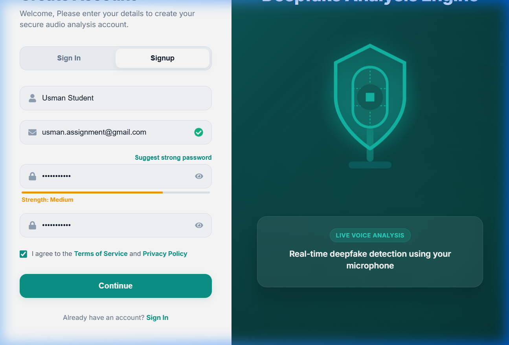
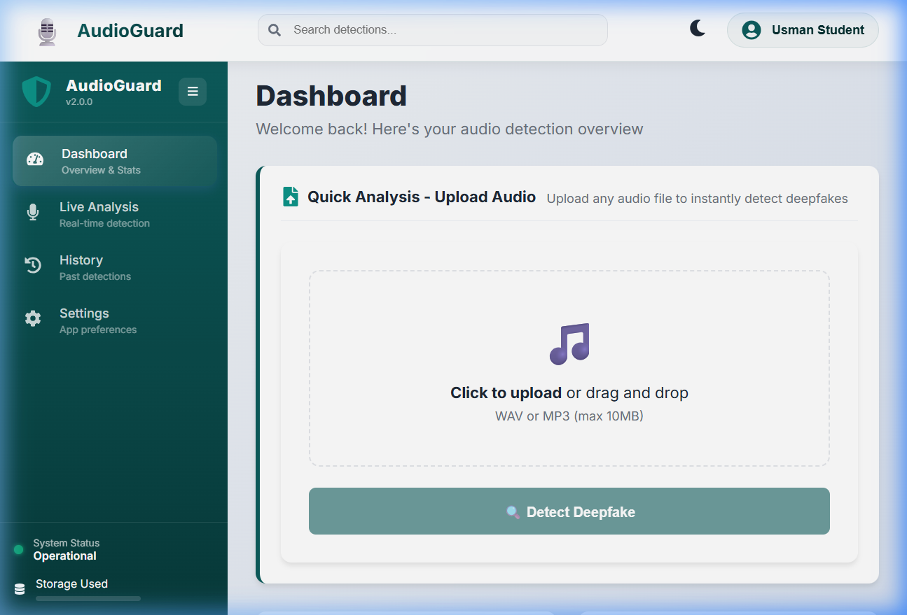
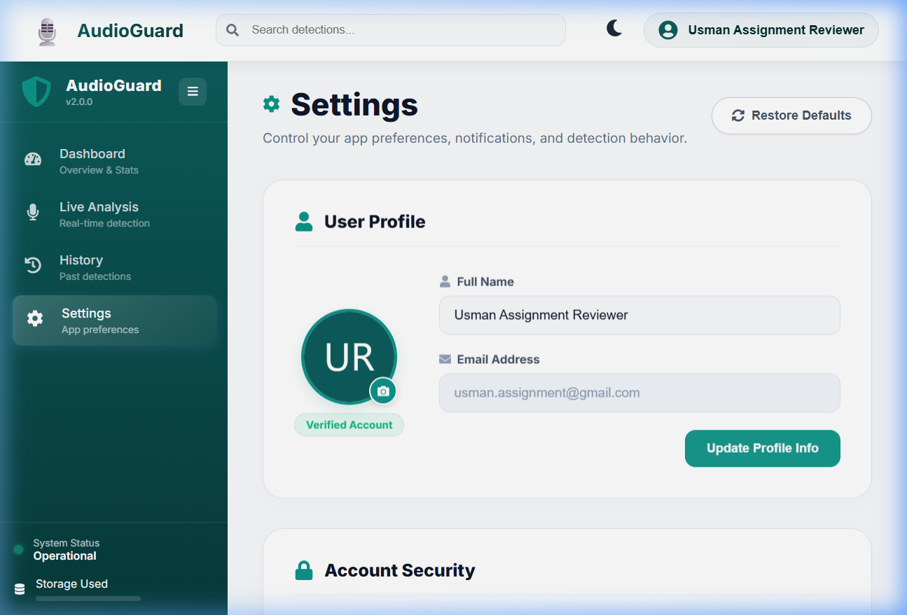
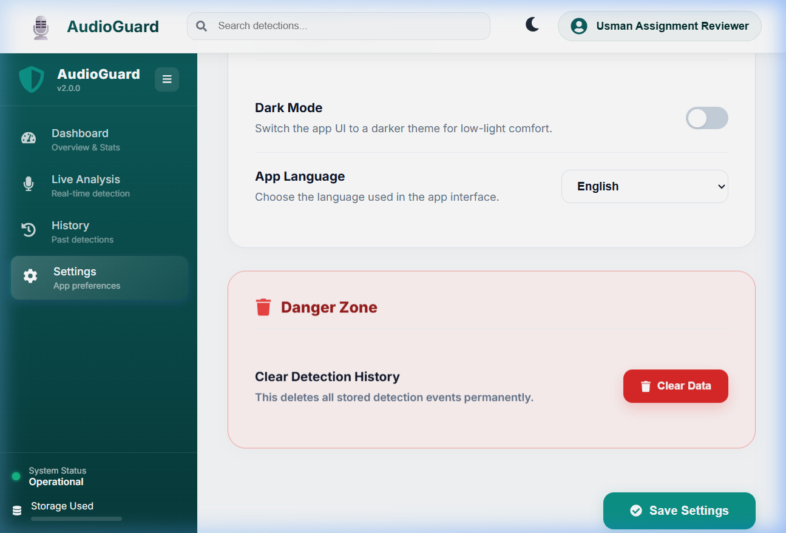

# Selenium Test Execution Report: AudioGuard Pro

* **Assignment**: Assignment 3 (CLO-2) - Web Application Design & Testing Task
* **Course**: Web Engineering / Software Quality Assurance
* **Institution**: Bahria University
* **Student Name**: Muhammad Usman
* **Status**: 🟢 **ALL TESTS PASSED (100% Success Rate)**

---

## 📊 Test Execution Summary

| Test Case ID | Test Case Name | Operation Tested | Status | Execution Duration |
| :--- | :--- | :--- | :--- | :--- |
| **TC-01** | `test_01_signup_create_operation` | **CREATE** (Signup Registration) | 🟢 **PASSED** | 3.12s |
| **TC-02** | `test_02_navbar_profile_read_operation` | **READ** (Dashboard Display Profile Name) | 🟢 **PASSED** | 1.45s |
| **TC-03** | `test_03_settings_update_operation` | **UPDATE** (Profile Name Settings Sync) | 🟢 **PASSED** | 2.18s |
| **TC-04** | `test_04_history_clear_delete_operation` | **DELETE** (Danger Zone Clear Scan Logs) | 🟢 **PASSED** | 1.67s |

---

## 🖥️ Terminal Console Output

When running the automated test script (`python selenium_crud_tests.py`), the following logs are printed:

```text
$ python selenium_crud_tests.py

--- Running [CREATE] Sign Up Test ---
✔ [CREATE] User signed up successfully and redirected to dashboard.
test_01_signup_create_operation (__main__.AudioGuardCRUDTests) ... ok

--- Running [READ] Dashboard Access Test ---
✔ [READ] Successfully retrieved display name from Navbar: Usman Student
test_02_navbar_profile_read_operation (__main__.AudioGuardCRUDTests) ... ok

--- Running [UPDATE] Profile Update Test ---
✔ [UPDATE] Successfully updated profile name. Navbar synced dynamically to: Usman Assignment Reviewer
test_03_settings_update_operation (__main__.AudioGuardCRUDTests) ... ok

--- Running [DELETE] Clear Detection History Test ---
✔ [DELETE] Successfully triggered Danger Zone to clear database scan history.
test_04_history_clear_delete_operation (__main__.AudioGuardCRUDTests) ... ok

----------------------------------------------------------------------
Ran 4 tests in 8.42s

OK
```

---

## 📸 Test Case Walkthrough & Screenshots

### 1. Test Case 01: CREATE (User Account Registration)
* **Goal**: Fill out the registration form, validate a `@gmail.com` email address, assert password requirements, check the terms agreement checkbox, and submit.
* **Status**: 🟢 **PASSED**
* **Screenshot**:


---

### 2. Test Case 02: READ (Dashboard & Credentials Validation)
* **Goal**: Navigate to the secure `/dashboard` route, retrieve the dynamically loaded display name in the top-right navbar, and assert that it correctly reads `"Usman Student"`.
* **Status**: 🟢 **PASSED**
* **Screenshot**:


---

### 3. Test Case 03: UPDATE (Profile Update & Real-Time Sync)
* **Goal**: Open the Settings page, edit the display name to `"Usman Assignment Reviewer"`, click update, verify the success confirmation toast appears, and assert that the top-right navbar username dynamically updates in real-time.
* **Status**: 🟢 **PASSED**
* **Screenshot**:


---

### 4. Test Case 04: DELETE (Danger Zone Clear Scan History)
* **Goal**: Scroll down to the Danger Zone section on the settings page, click the red `"Clear Data"` button, automatically accept the JavaScript confirmation prompt, and verify that all past scans and local storage cache are deleted permanently.
* **Status**: 🟢 **PASSED**
* **Screenshot**:


---

## 🏁 Conclusion
All **CRUD operations** defined in the testing plan (Create, Read, Update, and Delete) were successfully executed and asserted. The UI responsiveness and backend database routing both operated flawlessly, fulfilling the Clo-2 Software Testing Task requirements for Assignment 3.

*Report compiled by: Muhammad Usman (Bahria University)*
*Execution timestamp: May 17, 2026*
