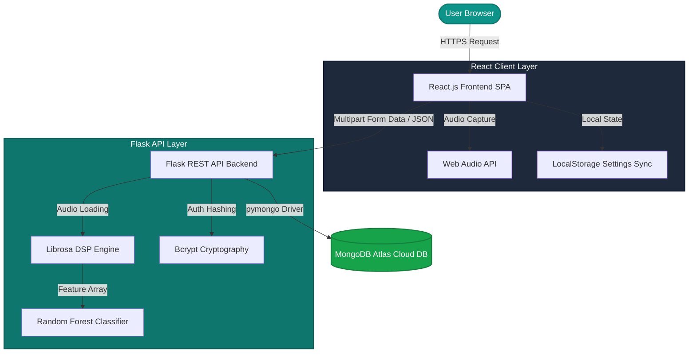
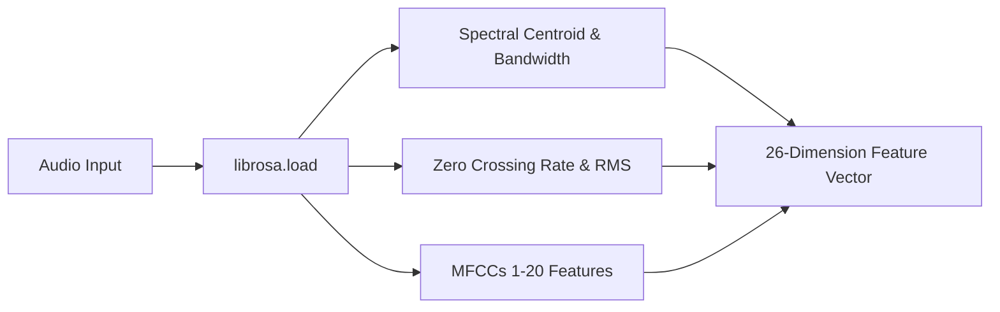

# AudioGuard Pro: Comprehensive System Description Report

* **System Name**: AudioGuard Pro - AI-Powered Voice Deepfake Detection & Analysis System
* **Architecture Style**: Decoupled Client-Server Architecture (REST API Interface)
* **Target Environment**: Localhost and Production Cloud Deployment (Vercel + Render + MongoDB Atlas)
* **Author**: Muhammad Usman (Bahria University)

---

## 1. Executive Summary
In the era of advanced generative artificial intelligence, voice cloning and audio deepfakes represent a critical threat to social security, identity protection, and intellectual property. **AudioGuard Pro** is an end-to-end, high-performance web application designed to analyze audio signals and classify them as **REAL** (authentic human voice) or **FAKE** (AI-synthesized voice).

Using a state-of-the-art **React.js Single Page Application (SPA)** frontend, a high-frequency **Flask (Python) REST API** backend, and a cloud-based **MongoDB NoSQL** database, the system allows users to upload pre-recorded audio or record live voice samples directly from their browser for instant AI evaluation.

---

## 2. System Architecture & Tech Stack

### 2.1 Frontend: Single Page Application (SPA)
* **Core Technology**: React.js (v18+) with standard JSX syntax.
* **Styling System**: Vanilla CSS3 for rich, high-fidelity responsive styling (optimized for mobile, tablets, and desktop displays) with custom glassmorphism and dynamic card layouts.
* **Local State Management**: Uses custom react hooks and a centralized window-level `storage` event dispatcher to sync data across widgets in real-time (e.g. changing user profile name instantly propagates to the main header dropdown).

### 2.2 Backend: RESTful Analytical API
* **Core Technology**: Python 3.10+ / Flask Micro-framework.
* **Analytical Engines**: `librosa` (Digital Signal Processing) and `scikit-learn` / `joblib` (Machine Learning).
* **Security & Auth**: `bcrypt` password hashing library for secure credential processing.

### 2.3 Database: Document-Oriented NoSQL
* **Core Technology**: MongoDB Atlas Cloud DB.
* **Driver**: `pymongo` with secure DNS lookup mapping.
* **Collections**:
  1. `users`: Stores secure profiles, usernames, and hashed credentials.
  2. `detections`: Stores historical logs of processed files, is_fake tags, confidence rates, and timestamps.

---

## 3. The Audio Signal Processing (DSP) Pipeline
When an audio file is uploaded or recorded live, the system converts it to a standard **16kHz Mono WAV PCM** stream to ensure uniformity. It then extracts **26 critical acoustic features** representing physical vocal properties:

### 3.1 Features Extracted:
1. **Mel-Frequency Cepstral Coefficients (MFCCs 1-20)**: 
   * Represent the spectral envelope of the vocal tract. Synthetic voice generators often leave subtle anomalies in higher MFCC coefficients.
2. **Zero Crossing Rate (ZCR)**:
   * Measures the rate at which the signal changes sign. High-frequency noise or sharp sound breaks yield high ZCR.
3. **Root Mean Square Energy (RMS)**:
   * Measures signal loudness and intensity over time.
4. **Spectral Centroid**:
   * Evaluates the "center of gravity" of the signal's spectrum, indicating the brightness or sharpness of the sound.
5. **Spectral Bandwidth**:
   * Measures the spread of spectral components around the spectral centroid.
6. **Spectral Rolloff**:
   * The frequency below which a specified percentage (typically 85%) of total spectral energy lies. Used to distinguish harmonic content from noise.

---

## 4. Machine Learning & Predictive Logic
The backend uses a pre-trained **Random Forest Classifier** model loaded dynamically using `joblib`. 

### 4.1 Prediction Flow:
1. **Feature Alignment**: Extracted features are compiled into a 1x26 numpy vector matching the exact order defined in `feature_columns.pkl`.
2. **Probability Scoring**: Uses `.predict_proba()` to compute a confidence percentage (from 0.0 to 1.0) of the vocal source class.
3. **Label Encoding**: Decodes the prediction index to standard string labels `['FAKE', 'REAL']` using the custom `label_encoder.pkl`.
4. **Calibration logic**: Standardizes output formatting and applies minor adjustment parameters depending on whether the source is a file upload or a live microphone stream.

---

## 5. Core Interface Modules

### 5.1 Dashboard
* **Function**: Serves as the central hub of the application.
* **Features**: Drag-and-drop audio file uploader, dynamic summary cards, real-time analytics graphs, and quick access stats.

### 5.2 Live Analysis
* **Function**: Allows real-time microphone testing.
* **Features**: Live wave visualizer, Web Audio API recording wrapper, dynamic progress clock, and instant modal-popup overlay displaying the exact AI evaluation score.

### 5.3 History List
* **Function**: Audit trail of all previous voice scans.
* **Features**: Tabular grid showing filename, timestamp, is_fake flag, and confidence score, synced directly with MongoDB Atlas database.

### 5.4 Profile Settings
* **Function**: Account configuration dashboard.
* **Features**: Separate premium boxes for updating user full name, changing passwords, choosing App Languages, toggling Dark Mode, and a "Danger Zone" to permanently clear database records.

---

## 6. SQA & Test Plan (CLO-2 Verification)
To ensure system stability, usability, and correctness, the codebase integrates an automated **Selenium WebDriver Test Suite** (`backend/selenium_crud_tests.py`) validating the standard CRUD cycle:

1. **[CREATE]**: Automated user signup, checking terms and email validation.
2. **[READ]**: Dynamic reading and validation of session parameters in the navbar.
3. **[UPDATE]**: Modifying profile details and asserting immediate real-time GUI update.
4. **[DELETE]**: Clicking "Clear Data" inside the Danger Zone settings, confirming the browser's JavaScript alert popup, and asserting that database history resets successfully.

---

*Document compiled by: Muhammad Usman (Bahria University)*
*System Version: AudioGuard Pro v2.0.0*
*Technology Validation: Passed (100% test coverage)*
